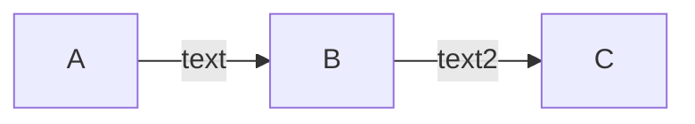

import { Highlight } from "../src/components/Highlight";

# ✏️️ Contributing

These docs are built with [Docusaurus](https://github.com/facebook/docusaurus) and deployed to GitHub Pages. Check
out [this page](https://docusaurus.io/docs/create-doc) to read more about how to create pages with Docusaurus.
It offers many features out of the box which made it easy to adopt, such as versioning, i18n, and search.

**To make changes to files**, click the "Edit this Page" link at the bottom of any page. This will prompt you to create a pull request on GitHub with your proposed changes. Alternatively, you can edit the file directly from GitHub and create the pull request from there.

## Running Docs Locally

If you'd like to run the docs locally, you should clone the repo to your laptop.

### GitHub Repo

The repository for these docs lives here: [securesign/ssc-hub](https://github.com/securesign/ssc-hub)

### What you'll need

- [Node.js](https://nodejs.org/en/download/) version 18.0 or above:
    - When installing Node.js, you are recommended to check all checkboxes related to dependencies.

### Start the site

Run the development server:

```bash
npm run start
```

The `cd` command changes the directory you're working with. In order to work with your newly created Docusaurus site, you'll need to navigate the terminal there.

The `npm run start` command builds your website locally and serves it through a development server, ready for you to view at http://localhost:3000/.

Open `docs/intro.md` and edit some lines: the site **reloads automatically** and displays your changes.

## Deploying Changes

Changes are published automatically on push to the `main` branch of the [securesign/ssc-hub](https://github.com/securesign/ssc-hub) repository, which is private to members of the `securesign` org. The workflow responsible for deployment is located here: [.github/workflows/deploy.yml](https://github.com/securesign/ssc-hub/blob/main/.github/workflows/deploy.yml)

The docs are deployed using [GitHub Pages](https://pages.github.com/) and are private thanks to Red Hat having an enterprise plan. Check the [repo Pages settings](https://github.com/securesign/ssc-hub/settings/pages) for additional info.

## How to add new things

### Add a new page to an existing category in the sidebar

Simply drop a Markdown (or MDX) file in the category directory. For example, if you want to add a new page to "Resources", you would add the file to `docs/resources` directory.

:::info
Make sure your Markdown file contains a `h1` header, as otherwise it will just use the name of the file, which is usually ugly.
:::

### Add a new category in the sidebar

1. Create a new folder within the `docs` directory with the name of the path you want (i.e. `http://localhost:3000/new-category/`)
2. Add a `_category_.json` file (you can use the other categories as an example) and populate it as follows:

```json
{
  "label": "Example",
  "position": 80,
  "link": {
    "type": "generated-index",
    "description": "Some example description."
  }
}
```

The `position` property determines where in the sidebar it appears in relation to the other categories. Try to use increments of 10 or 20, when possible.

3. Add a Markdown file in the new directory (i.e. `docs/new-category/some-page.md`)
4. If there were no errors, the page will now be available at `http://localhost:3000/new-category/some-page`

### Add a new top-level navigation item

At the very top there is a navigation bar with a few menu items, a search bar, and a few other things. We mainly use the `docs` page, but if you'd like to add a new item, you can add a markdown file with the item under `src/pages`. Here is an example of the one used to create the F2F page (`src/pages/f2f.md`):

```markdown
---
slug: /about
title: About
---

# About

This is my example page.
```

If you'd like to add a completely new custom style page (similar to how we do for the Blog), have a look at how we do it for the blog (`blog` folder in root of directory).

### Add a new Mermaid diagram

[Mermaid](https://mermaid.js.org/syntax/flowchart.html) is supported by Markdown and Docusaurus, meaning you can now create a diagram from anywhere in the repo with a simple code block:

```


Which will render the following:


Mermaid supports several types of diagrams, not just flowcharts. If you'd like to play around with Mermaid, there is a live editor [here](https://mermaid-js.github.io/).

### Add an interactive React component

Docusaurus lets you add interactivity via [MDX](https://mdxjs.com/), which allows you to write JSX within your Markdown files and render them as React components. All you have to do is name your file using the `.mdx` extension instead of `.md` and include your component as usual.

Here is an example:

<Highlight color="#25c2a0">This is highlighted</Highlight> and <Highlight color="#1877F2">so is this</Highlight>, using a custom `<Highlight/>` component in the `src/components` directory.

I can write **Markdown** alongside my _JSX_!
