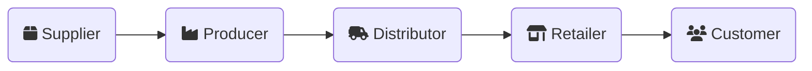

import trojanWar from "/img/rawpixel-id-10012717.jpg";

# Software Supply Chain Security

<!-- tldr; -->

:::note[tldr;]

A **software supply chain** is an interconnected network of people, processes, software libraries, firmware, and technologies used in the creation, development, publication, production, and distribution of digital products.

Software supply chain security involves protecting every step of the supply chain—ensuring the integrity, authenticity, and trustworthiness of software artifacts and processes to prevent tampering, vulnerabilities, and unauthorized access.

:::

With incidents like Log4Shell dominating headlines in recent years, it's no surprise that software supply chain security has become a hot topic. But supply chains, as we traditionally know them, aren't typically associated with software. So, what's the connection?

## Understanding Supply Chains

A **supply chain** is the series of steps and processes involved in creating a product or delivering a service. When we think about supply chains, the first image that comes to mind is often the movement of physical goods—from raw materials to finished products reaching customers.

Most people are aware of the complexity of supply chains, involving networks of suppliers, producers, and distributors. However, what often goes unnoticed is how many opportunities exist for something to go wrong during this process.

### Early Supply Chain Attacks

Supply chain attacks are not a new concept. A well-known example around 12th century BC is the Trojan horse from Ancient Greece. The Greeks, unable to breach the walls of Troy, pretended to leave a gift: a large wooden horse. The Trojans trusted the gift, brought it inside their city walls, and celebrated.

But hidden within the horse were Greek soldiers, who emerged at night to open the gates for their army, leading to Troy's fall. The Greeks didn't attack directly; they exploited trust in the "supply."

Supply chain attacks have become more sophisticated over time, but are still regular occurrences around the world on a daily basis. Think counterfeit goods, tampered machinery and materials, to name just a few.

Software supply chain attacks aren't all that different to "normal" supply chain attacks: attackers corrupt a trusted source or process, leading to widespread compromise. As a consumer, how can you be certain that what you receive hasn't been tampered with along the way?

### Shifting Left: Evolution of Attacks

Over time, attackers have shifted their focus further up the chain. Instead of targeting end products, they now attack design and development processes, build pipelines, dependencies and third-party components.

In parallel, they employ broader tactics like ransomware, data breaches, and intellectual property theft, disrupting supply chains and rendering organizations unable to deliver their products or services.

One example of a recent supply chain attack was the SolarWinds hack in 2020. Hackers infiltrated the build process of SolarWinds' Orion software (a popular IP network management tool) and added malware to an update, causing customers who trusted in SolarWinds to install the malware unknowingly.

:::info[Did You Know?]

1 in 5 data breaches is a software supply chain attack.

:::

These events raise a critical question: **What if the code you trust the most is what makes your systems vulnerable?**

In many cases, there is no guarantee that the software we run is the same as the software we built. This gap creates opportunities for attackers to exploit.

### Who is involved in a supply chain?

If your organization provides products or services to others, your organization is part of the supply chain. Imagine the steps involved in making a pizza:

1. A farmer grows tomatoes.
2. A factory turns tomatoes into sauce.
3. A bakery makes dough.
4. A store sells cheese.
5. A pizzeria assembles the ingredients into a pizza.
6. The pizza is delivered to your door.

Each step involves different participants, individually contributing to the final product. If _any_ part of this process is disrupted or tampered with, the quality and safety of the pizza are at risk. Software supply chains don't operate all that differently. Let's take a closer look in the next section.

## Software Supply Chains

### What is a software supply chain?

<!-- 1. What is it -->
<!-- 2. Why should I care -->
<!-- 3. Example software supply chain & attack -->
<!-- 4. What to do about it -->

A **software supply chain** is an interconnected network of people, processes, software libraries, firmware, and technologies used in the creation, development, publication, production, and distribution of digital products. The primary difference to general supply chain security is the software or firmware development and its distribution.

Here is a simplified view of a software supply chain:

1. **Source**: Writing or acquiring code (including third-party libraries).
2. **Build**: Transforming source code into executable software.
3. **Deploy**: Delivering software to customers or systems.
4. **Monitor**: Observing software in production to detect issues.

<!-- Traditionally, the world has focused on "Source" and "Monitor." However, incidents like Log4Shell have demonstrated the need to secure the entire chain—especially build and deployment processes. -->

### Securing software supply chains

Given the increasing reliance on third-party components, open source libraries, and interconnected systems in modern software development, securing the software supply chain has become a critical aspect of organizational security posture.

While there are many controls available to reduce risk, following an official framework like [SLSA](/slsa-supply-chain-levels-compliance-for-software-artifacts) or S2C2F will help prevent gaps in your approach. The supply chain is a prime target for attackers due to its complexity and interdependencies. In other words, there is a lot that can and will go wrong. Have a look at the [Compliance](/category/compliance) section to learn more about some of the most common security frameworks.

In addition, if you or your organization is producing and/or distributing software, it's essential that you ensure the trust and integrity of the software to your clients. One way to do that is by making your software as transparent to consumers as possible. A [Software Bill of Materials](/what-is-an-sbom-software-bill-of-materials-and-why-does-it-matter), or SBOM, maps out the components and dependencies of a piece of software, including any previously identified vulnerabilities. SBOMs are usually a requirement when following the most popular security frameworks, and while they are indeed a critical part of software transparency, it is only a part of the bigger picture.

