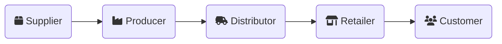

import trojanWar from "/img/rawpixel-id-10012717.jpg";

# Software Supply Chain Security

<!-- tldr; -->

With incidents like Log4Shell dominating headlines in recent years, it's no surprise that software supply chain security has become a hot topic. But supply chains, as we traditionally know them, aren't typically associated with software. So, what's the connection?

## Understanding Supply Chains

A **supply chain** is the series of steps and processes involved in creating a product or delivering a service. When we think about supply chains, the first image that comes to mind is often the movement of physical goods—from raw materials to finished products reaching customers.

Most people are aware of the complexity of supply chains, involving networks of suppliers, producers, and distributors. However, what often goes unnoticed is how many opportunities exist for something to go wrong during this process.

## Early Supply Chain Attacks

Supply chain attacks are not a new concept. A well-known example is the Trojan horse from Ancient Greece (~12th century BC). The Greeks, unable to breach the walls of Troy, pretended to leave a gift: a large wooden horse. The Trojans trusted the gift, brought it inside their city walls, and celebrated.

But hidden within the horse were Greek soldiers, who emerged at night to open the gates for their army, leading to Troy's fall. The Greeks didn't attack directly; they exploited trust in the "supply."

In software, supply chain attacks work similarly: attackers corrupt a trusted source or process, leading to widespread compromise. As a consumer, how can you be certain that the software you receive hasn't been tampered with along the way?

## Shifting Left: Evolution of Attacks

Over time, attackers have shifted their focus further up the chain. Instead of targeting end products, they now attack:

- Design and development processes
- Build pipelines
- Dependencies and third-party components

In parallel, they employ broader tactics like ransomware, data breaches, and intellectual property theft, disrupting supply chains and rendering organizations unable to deliver their products or services.

:::info[Did You Know?]

1 in 5 data breaches is a software supply chain attack.

:::

This raises a critical question: **What if the code you trust the most is what makes your systems vulnerable?**

In many cases, there’s no guarantee that the software we run is the same as the software we built. This gap creates opportunities for attackers to exploit.

### Who is involved in a supply chain?

If your organization provides products or services to others, your organization is part of the supply chain. Imagine making a pizza:

1.	A farmer grows tomatoes.
2.	A factory turns tomatoes into sauce.
3.	A bakery makes dough.
4.	A store sells cheese.
5.	A pizzeria assembles the ingredients into a pizza.
6.	The pizza is delivered to your door.

Each step involves different participants, each contributing to the final product. If any part of this process is disrupted or tampered with, the quality and safety of the pizza are at risk.

### Software Supply Chains

Software supply chains operate similarly to traditional supply chains. Here's a simplified view:

1. **Source**: Writing or acquiring code (including third-party libraries).
2. **Build**: Transforming source code into executable software.
3. **Deploy**: Delivering software to customers or systems.
4. **Monitor**: Observing software in production to detect issues.

Traditionally, cybersecurity focused on "Source" and "Monitor." However, incidents like Log4Shell have demonstrated the need to secure the entire chain—especially build and deployment processes.
