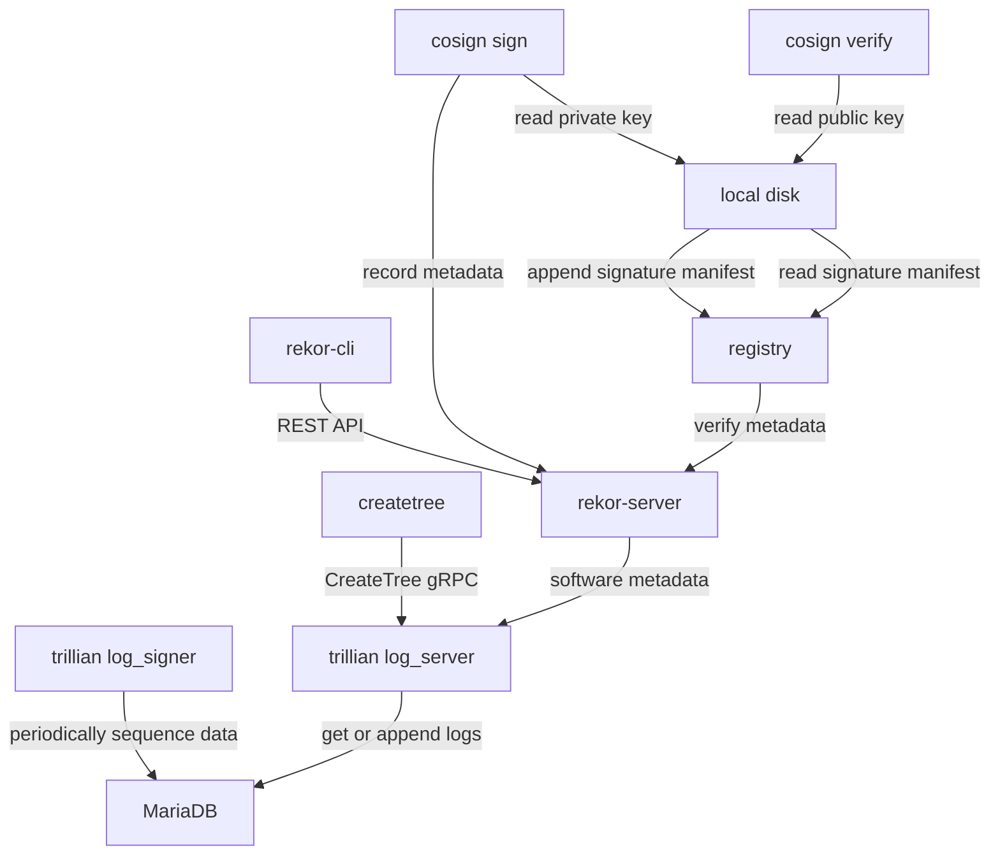

```mermaid
graph TD
    createtree[createtree] -->|CreateTree gRPC| trillian_log_server
    trillian_log_signer[trillian log_signer] -->|periodically sequence data| MariaDB
    trillian_log_server[trillian log_server] -->|get or append logs| MariaDB
    rekor-cli[rekor-cli] -->|REST API| rekor-server
    rekor-server[rekor-server] -->|software metadata| trillian_log_server
    cosign_sign[cosign sign] -->|record metadata| rekor-server
    cosign_sign -->|read private key| local_disk
    local_disk[local disk] -->|append signature manifest| registry
    cosign_verify[cosign verify] -->|read public key| local_disk
    local_disk -->|read signature manifest| registry
    registry -->|verify metadata| rekor-server
```

